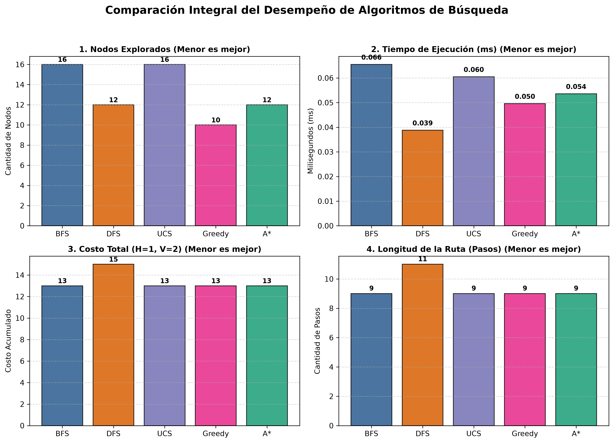
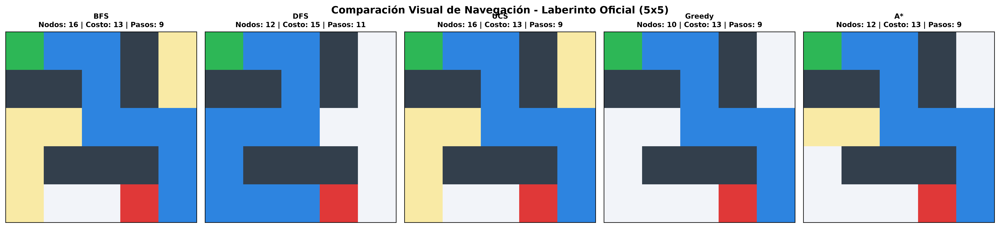
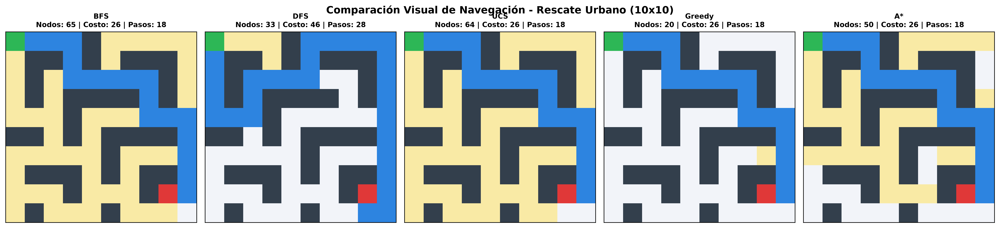
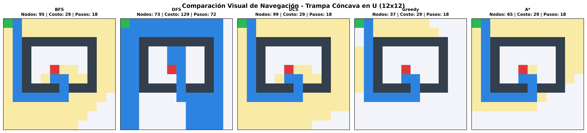

# 🤖 Sistema Inteligente de Búsqueda y Navegación en Laberintos

<div align="center">

[](https://www.python.org/downloads/)
[](https://opensource.org/licenses/MIT)
[](https://www.puce.edu.ec/)
[](#)
[](#)

<p align="center">
  <b>Proyecto Final de Inteligencia Artificial (NRC: 1371)</b><br>
  <b>Pontificia Universidad Católica del Ecuador (PUCE)</b><br>
  <i>Facultad de Ingeniería — Carrera de Ingeniería de Software / TI</i>
</p>

**Autor:** Isaac Oña &nbsp;|&nbsp; **Docente:** Ing. Patricio Alvear

[🚀 Características](#-características-principales) •
[🧠 Algoritmos](#-algoritmos-implementados) •
[📊 Benchmarks](#-resultados-y-benchmarks-experimentales) •
[🛠️ Instalación y Uso](#️-instalación-y-guía-de-uso) •
[📁 Estructura](#-estructura-del-proyecto)

</div>

---

## 📌 Visión General del Proyecto

Este repositorio contiene la arquitectura, desarrollo e investigación experimental de un **Sistema Inteligente de Búsqueda y Navegación Autónoma en Laberintos**, concebido bajo el contexto de **Búsqueda y Rescate Urbano (USAR - *Urban Search and Rescue*)** en edificaciones colapsadas.

El agente autónomo debe planificar una trayectoria óptima desde una posición inicial de despliegue $S$ hasta una zona de extracción de víctimas o meta $G$, sobre una cuadrícula bidimensional $M \times N$ con obstáculos intransitables (escombros/muros) y un **modelo de costos de movimiento asimétricos**:

$$\text{Costo}(u, v) = \begin{cases} 1 & \text{si el desplazamiento es Horizontal } (\leftarrow, \rightarrow) \\ 2 & \text{si el desplazamiento es Vertical } (\uparrow, \downarrow) \end{cases}$$

> 💡 **Fundamento Físico del Costo Asimétrico:** El desplazamiento vertical simula la resistencia motriz contra la gravedad, rampas empinadas y el esfuerzo mecánico al trepar sobre escombros irregulares, mientras que el desplazamiento horizontal sobre superficies niveladas requiere menor consumo energético.

---

## 📸 Demostración Visual y Galería

<div align="center">
  <table>
    <tr>
      <td align="center"><b>Gráfico Comparativo de Rendimiento (4 Métricas)</b></td>
      <td align="center"><b>Laberinto Oficial 5x5 Resuelto con A*</b></td>
    </tr>
    <tr>
      <td></td>
      <td></td>
    </tr>
    <tr>
      <td align="center"><b>Escenario de Rescate Urbano (10x10)</b></td>
      <td align="center"><b>Trampa Cóncava en U (12x12)</b></td>
    </tr>
    <tr>
      <td></td>
      <td></td>
    </tr>
  </table>
</div>

---

## 🧠 Algoritmos Implementados y Análisis Teórico

Se implementaron de forma nativa en Python 5 algoritmos fundamentales del paradigma de búsqueda en espacios de estados, categorizados en **Búsqueda Ciega (No Informada)** y **Búsqueda Heurística (Informada)**:

| Categoría | Algoritmo | Estructura de Datos | Complejidad Temporal | Complejidad Espacial | ¿Completo? | ¿Óptimo en Costo Asimétrico? |
| :--- | :--- | :--- | :---: | :---: | :---: | :---: |
| **No Informada** | **BFS** (*Breadth-First Search*) | Cola FIFO (`collections.deque`) | $O(b^d)$ | $O(b^d)$ | **Sí** | ⚠️ No *(optimiza número de pasos, no costo ponderado)* |
| **No Informada** | **DFS** (*Depth-First Search*) | Pila LIFO (`list`) | $O(b^m)$ | $O(b \cdot m)$ | **Sí** *(en grafos finitos con ciclo-check)* | ❌ No *(vulnerable a desvíos y caminos largos)* |
| **No Informada** | **UCS** (*Uniform Cost Search*) | Min-Heap (`heapq` por $g(n)$) | $O(b^{1 + \lfloor C^*/\epsilon \rfloor})$ | $O(b^{1 + \lfloor C^*/\epsilon \rfloor})$ | **Sí** | **Sí (Garantizado)** |
| **Informada** | **Greedy Best-First** (Avara) | Min-Heap (`heapq` por $h(n)$) | $O(b^m)$ | $O(b^m)$ | **Sí** | ❌ No *(puede caer en trampas y callejones sin salida)* |
| **Informada** | **A\*** (*A-Star Search*) | Min-Heap (`heapq` por $f=g+h$) | $O(b^d)$ | $O(b^d)$ | **Sí** | **Sí (Óptimo y Eficiente)** |

### 📐 Función Heurística (Distancia Manhattan)

Para los algoritmos informados (Greedy y A\*), se utiliza la distancia Manhattan adaptada al plano ortogonal:

$$h(n) = |x_n - x_G| + |y_n - y_G|$$

* **Admisibilidad Demostrada:** $h(n) \le h^*(n)$ para todo nodo $n$. Dado que el costo mínimo de movimiento unitario en la cuadrícula es $c_{\min} = 1$, la distancia Manhattan representa la cota inferior absoluta sin obstáculos, por lo que jamás sobrestima el costo real a la meta.
* **Consistencia (Monotonía):** Satisface la desigualdad triangular $h(n) \le c(n, a, n') + h(n')$, garantizando que los valores de $f(n) = g(n) + h(n)$ nunca decrecen a lo largo de una trayectoria de búsqueda en grafos y que la primera expansión a la meta es óptima.

---

## 🚀 Características Principales

1. **🎨 Interfaz Gráfica Moderna e Interactiva (Tkinter):**
   * **Editor de Rejilla en Vivo:** Dibuja y borra muros, celdas transitables, punto de inicio ($S$) y meta ($G$) con clics y arrastre del ratón.
   * **Animación Paso a Paso:** Visualización en tiempo real de la frontera de exploración (nodos evaluados) y el trazado de la ruta final solución.
   * **Control de Velocidad:** Slider interactivo con retardo ajustable de 1 ms a 150 ms o modo de resolución instantánea.
   * **Tarjetas de Métricas en Vivo:** Monitoreo instantáneo de nodos explorados, tiempo de cálculo (ms), costo total y longitud del trayecto.
   * **Modal de Benchmarking Integrado:** Ejecuta y compara simultáneamente los 5 algoritmos sobre el mapa activo con tablas formateadas (`Treeview`) y visualización de gráficos Matplotlib.

2. **🧪 Catálogo de Escenarios y Generador Estocástico Soluble:**
   * **Preset 1 (Oficial 5x5):** Caso de estudio oficial de la guía docente.
   * **Preset 2 (Rescate Urbano 10x10):** Múltiples rutas alternativas con cuellos de botella.
   * **Preset 3 (Trampa Cóncava en U 12x12):** Diseñado para desafiar la heurística greedy obligando a retroceder de mínimos locales.
   * **Preset 4 (Complejo Gran Escala 16x16):** Entorno denso para pruebas de escalabilidad y memoria.
   * **Generador Aleatorio Inteligente:** Crea laberintos estocásticos con densidad de obstáculos parametrizable garantizando conectividad inicio-meta mediante validación BFS.

3. **📊 Suite de Benchmarking y Visualización Estadística:**
   * Generación automática de figuras multipanel 2x2 (Nodos, Tiempos, Costo y Pasos) exportadas en formato PNG de alta resolución (`assets/`).

4. **📄 Generador Automatizado de Informes Académicos (APA 7):**
   * Compilador en Python (`src/utils/report_generator.py`) que genera el documento formal en Word (`.docx`) con formato APA 7ma Edición, incluyendo carátula institucional, resumen ejecutivo, tablas de benchmarking y análisis comparativo.

---

## 📊 Resultados y Benchmarks Experimentales

### 🔬 Comparativa Cuantitativa en Laberinto Oficial 5x5

```text
=========================================================================================
MÉTRICA EVALUADA          | BFS        | DFS        | UCS        | Greedy     | A*        
=========================================================================================
Nodos explorados          | 16         | 12         | 16         | 10         | 12        
Tiempo ejecución (ms)     | 0.0631     | 0.0388     | 0.0590     | 0.0382     | 0.0464    
Costo total (H=1, V=2)    | 13         | 15         | 13         | 13         | 13        
Longitud ruta (pasos)     | 9          | 11         | 9          | 9          | 9         
¿Ruta Óptima en Costo?    | No*        | No         | Sí (Mín.)  | Coincidente| Sí (Mín.) 
=========================================================================================
```
*\*Nota: BFS garantiza la ruta con menor número de pasos (9), coincidiendo en este laberinto con el costo óptimo de 13.*

### 📈 Conclusiones Clave de la Investigación

1. **A\* vs. UCS:** A\* explora un **25% menos de nodos** que UCS en el mapa oficial alcanzando idéntico costo óptimo (13), demostrando el beneficio de la poda dirigida por la heurística Manhattan.
2. **Greedy Best-First:** Es el algoritmo más veloz en entornos abiertos sin trampas complejas, pero en presencia de obstáculos cóncavos en U puede quedar atrapado en mínimos locales y generar rutas subóptimas.
3. **DFS:** Aunque requiere menor memoria en espacios profundos, en cuadrículas no dirigidas suele explorar ramas erráticas profundas, entregando la peor calidad de trayectoria (costo 15, 11 pasos).
4. **BFS vs. UCS en Costos Asimétricos:** Mientras BFS trata todos los arcos con peso unitario, UCS prioriza los movimientos horizontales ($c=1$) sobre los verticales ($c=2$), asegurando siempre el menor costo energético.

---

## 🛠️ Instalación y Guía de Uso

### Prerrequisitos
* **Python 3.8 o superior** instalado ([Descargar Python](https://www.python.org/downloads/)).
* Sistema Operativo: Windows, macOS o Linux.

### 1. Clonar el Repositorio
```bash
git clone https://github.com/dalton-isaac/Sistema-de-Navegacion-Laverintos.git
cd Sistema-de-Navegacion-Laverintos
```

### 2. Crear y Activar un Entorno Virtual (Recomendado)
```bash
# En Windows (PowerShell):
python -m venv .venv
.venv\Scripts\Activate.ps1

# En Linux / macOS:
python3 -m venv .venv
source .venv/bin/activate
```

### 3. Instalar Dependencias
```bash
pip install -r requirements.txt
```

### 4. Modos de Ejecución

#### 🖥️ A. Modo Interfaz Gráfica (GUI Tkinter) — *Por Defecto*
```bash
python main.py
```
*(También compatible mediante: `python ProyectoFinal.py`)*

#### ⚡ B. Modo Benchmark por Consola y Exportación de Gráficos
Ejecuta el protocolo de pruebas experimental en todos los presets de laberinto y genera los gráficos PNG en `assets/`:
```bash
python main.py --benchmark
# o abreviado:
python main.py -b
```

#### 📄 C. Compilar el Informe Técnico Formal APA 7 (Word)
Genera el informe académico con formato oficial en `docs/Proyecto Final Fundamentos de Inteligencia Artificial.docx`:
```bash
python main.py --report
# o mediante:
python generate_report.py
```

---

## 📁 Estructura del Proyecto

El proyecto sigue una arquitectura limpia y modular desacoplada:

```text
Sistema-de-Navegacion-Laverintos/
├── assets/                                      # Gráficos estadísticos y capturas visuales
│   ├── grafico_comparativo_oficial.png          # Figura 2x2 de métricas comparativas
│   ├── grafico_preset_1.png                     # Benchmark Preset 1 (5x5)
│   ├── grafico_preset_2.png                     # Benchmark Preset 2 (10x10)
│   ├── grafico_preset_3.png                     # Benchmark Preset 3 (12x12)
│   ├── grafico_preset_4.png                     # Benchmark Preset 4 (16x16)
│   ├── mapa_visual_oficial.png                  # Visualización mapa oficial 5x5
│   ├── mapa_visual_urbano.png                   # Visualización rescate urbano 10x10
│   └── mapa_visual_trampa.png                   # Visualización trampa cóncava 12x12
├── docs/                                        # Documentación académica y especificaciones
│   ├── PROYECTO FINAL FUNDAMENTOS DE INTELIGENCIA ARTIFICIAL.pdf
│   ├── Proyecto Final Fundamentos de Inteligencia Artificial.docx
│   └── Resultados_y_Plan_Implementacion.txt
├── src/                                         # Código fuente modularizado del sistema
│   ├── __init__.py                              # Metadata del paquete principal
│   ├── core/                                    # Lógica pura de Inteligencia Artificial
│   │   ├── __init__.py
│   │   ├── algorithms.py                        # Algoritmos BFS, DFS, UCS, Greedy y A*
│   │   ├── heuristics.py                        # Modelo de costos (H=1, V=2) y distancia Manhattan
│   │   └── maze.py                              # Catálogo de presets y generador estocástico
│   ├── gui/                                     # Interfaz Gráfica de Usuario (Tkinter)
│   │   ├── __init__.py
│   │   └── app.py                               # Canvas interactivo, animaciones y modales
│   └── utils/                                   # Utilidades auxiliares
│       ├── __init__.py
│       ├── plotting.py                          # Generador de gráficos de barras con Matplotlib
│       └── report_generator.py                  # Generador de reporte APA 7 en python-docx
├── main.py                                      # Punto de entrada principal (GUI, CLI, Benchmarks)
├── ProyectoFinal.py                             # Script de compatibilidad directa
├── generate_report.py                           # Script de generación directa del informe Word
├── requirements.txt                             # Especificación de dependencias
├── .gitignore                                   # Filtros de exclusión Git
└── README.md                                    # Documentación técnica del repositorio
```

---

## 👨‍💻 Créditos e Información Académica

* **Institución:** [Pontificia Universidad Católica del Ecuador (PUCE)](https://www.puce.edu.ec/)
* **Facultad:** Facultad de Ingeniería
* **Asignatura:** Fundamentos de Inteligencia Artificial (NRC: 1371)
* **Autor:** Isaac Oña
* **Docente Supervisor:** Ing. Patricio Alvear
* **Licencia:** Este proyecto está bajo la Licencia [MIT](LICENSE) — libre para uso académico y formativo.
